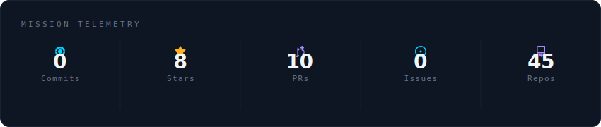

# Minha trajetória profissional

## Stacks

  

 

  

 

## Language telemetry

  

 

## Projetos em andamento

  

 

---

Olá! Sou **Gabriel Fernandes**, desenvolvedor. Atualmente atuo como DBA e em integração entre sistemas.

---

## Sobre mim

Atuo na interseção entre **Frontend**, **Backend** e **DevOps**, com experiência em:

- **Backend:** Python, PostgreSQL (DBA e otimização de queries), integração de sistemas
- **DevOps:** Docker, Kubernetes, Jenkins
- **Frontend:** TypeScript, React, CSS

---

## Linha do tempo

| Período | Onde | O que fiz |
|--------|------|-----------|
| ago 2022 – presente | **Topocart** Topografia, Engenharia e Aerolevantamentos — Brasília, DF (híbrido) | **DBA.** Consultas SQL e otimização em PostgreSQL; ETL com Python, TypeScript e n8n; automatização de processos com Python, TypeScript e Jenkins; melhoria contínua. |
| nov 2021 – ago 2022 · 10 meses | **Tribunal Regional Federal da 1ª Região** — Brasília, DF (estágio) | **Desenvolvimento PHP.** Back-end com PHP e Laravel; front-end com HTML, CSS, Bootstrap, jQuery e JavaScript; sistemas internos e suporte a aplicações. |

---

## Projetos em destaque

- **[MCP_Metrics](https://github.com/GabrielFernandesDEV/MCP_Metrics)** — ponte entre Prometheus (MCP) e LLMs para consultar métricas e observabilidade em linguagem natural.

---

## Contato

- **Email:** [gabrielfernandes.dev@gmail.com](mailto:gabrielfernandes.dev@gmail.com)
- **LinkedIn:** [gabriel-fernandes-dev1](https://www.linkedin.com/in/gabriel-fernandes-dev1/)
- **Site:** [gabrielfernandes.dev](https://gabrielfernandes.dev)

---

